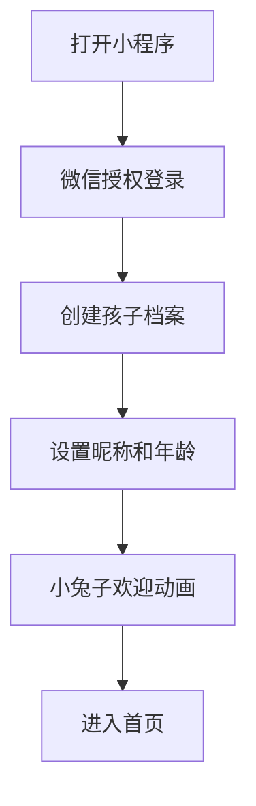
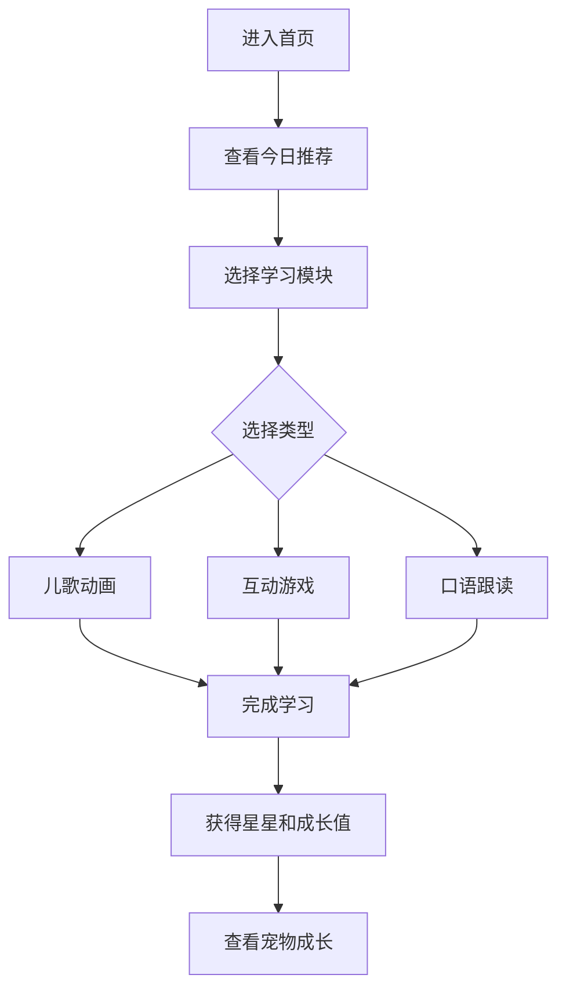
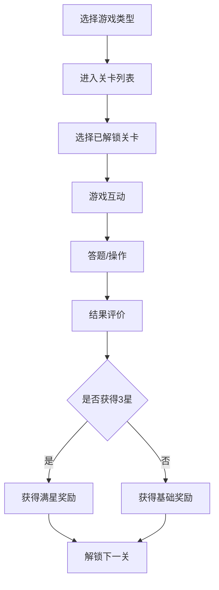

# 兔兔英语 - 幼儿英语启蒙小程序 PRD

## 1. 产品概述

兔兔英语是一款面向2-5岁儿童的英语启蒙微信小程序，以Q萌小兔子IP为核心陪伴形象，通过动画儿歌、互动游戏、AI口语跟读三大核心玩法，让孩子在趣味互动中自然习得英语。产品按年龄（2-3岁/3-4岁/4-5岁）智能分级，同时配备完整家长中心，实现学习报告、时长管控等功能。

- 目标用户：2-5岁儿童（使用者）+ 其家长（管理者/决策者）
- 核心价值：让孩子在玩中学、学中玩，用趣味化方式实现英语启蒙

## 2. 核心功能

### 2.1 用户角色

| 角色 | 注册方式 | 核心权限 |
|------|----------|----------|
| 家长 | 微信授权登录 | 管理孩子信息、查看学习报告、设置时长管控 |
| 儿童 | 家长创建档案 | 浏览学习内容、参与游戏互动、口语跟读 |

### 2.2 功能模块

1. **首页**：IP形象展示、今日推荐、快速入口、学习进度、年龄切换
2. **儿歌动画页**：儿歌分类列表、视频播放、歌词同步
3. **互动游戏页**：游戏类型选择（点选/拼图/涂色）、关卡列表、游戏界面
4. **口语跟读页**：发音示范、录制跟读、AI评分纠音
5. **宠物岛页**：宠物养成、收集徽章、星星积分
6. **家长中心页**：学习报告、时长管控、护眼设置、孩子档案管理

### 2.3 页面详情

| 页面名称 | 模块名称 | 功能描述 |
|----------|----------|----------|
| 首页 | 顶部问候区 | 小兔子IP动态问候，显示当前时段（早上好/下午好/晚上好） |
| 首页 | 今日推荐 | 根据年龄和学习进度推荐1-2个今日学习内容 |
| 首页 | 快速入口 | 四宫格入口：儿歌动画、互动游戏、口语跟读、宠物岛 |
| 首页 | 学习进度 | 环形进度条显示今日学习完成度 |
| 首页 | 年龄切换 | 底部年龄标签，2-3岁/3-4岁/4-5岁快速切换 |
| 儿歌动画页 | 分类标签 | 按主题分类：动物、颜色、数字、日常、节日等 |
| 儿歌动画页 | 儿歌列表 | 卡片式展示，缩略图+标题+时长 |
| 儿歌动画页 | 播放器 | 全屏视频播放，歌词同步高亮，循环/切歌控制 |
| 互动游戏页 | 游戏类型 | 点选类/拼图类/涂色类三大类型选择 |
| 互动游戏页 | 关卡列表 | 已解锁/未解锁关卡展示，星级评价 |
| 互动游戏页 | 点选游戏 | 听发音点击正确图片，答对鼓励动画+音效 |
| 互动游戏页 | 拼图游戏 | 拖拽碎片拼成完整图案，完成后学习单词 |
| 互动游戏页 | 涂色游戏 | 选色板+画笔工具，涂色完成学颜色词汇 |
| 口语跟读页 | 发音示范 | 播放标准发音，配合口型动画 |
| 口语跟读页 | 跟读录制 | 按住麦克风按钮录制跟读 |
| 口语跟读页 | AI评分 | 星级评分+发音纠正提示 |
| 宠物岛页 | 宠物展示 | 小兔子宠物动态展示，根据学习成长变化 |
| 宠物岛页 | 成长值 | 经验条+等级显示，学习获得成长值 |
| 宠物岛页 | 徽章墙 | 已收集徽章展示，未收集徽章灰色预览 |
| 宠物岛页 | 星星积分 | 当前星星数量，可兑换虚拟物品 |
| 家长中心页 | 学习报告 | 日/周/月维度的学习时长、内容统计 |
| 家长中心页 | 时长管控 | 设置每日使用上限，定时休息提醒开关 |
| 家长中心页 | 护眼设置 | 定时休息提醒间隔设置（15/20/25分钟） |
| 家长中心页 | 孩子档案 | 管理/创建孩子档案，设置年龄和昵称 |

## 3. 核心流程

### 3.1 首次使用流程

用户打开小程序 → 微信授权登录 → 创建孩子档案（设置昵称、年龄） → 进入首页 → 小兔子欢迎动画 → 开始学习

### 3.2 日常学习流程

进入首页 → 查看今日推荐 → 选择学习模块 → 完成学习任务 → 获得星星/成长值 → 查看宠物成长

### 3.3 互动游戏流程

选择游戏类型 → 进入关卡列表 → 选择已解锁关卡 → 游戏互动 → 答题/操作 → 结果评价（星级） → 获得奖励 → 解锁下一关

## 4. 用户界面设计

### 4.1 设计风格

- **主色调**：暖橙色 (#FF8C42) 作为主色，传递温暖活力感
- **辅助色**：薄荷绿 (#7ED957) 用于成功/正确反馈，天空蓝 (#64B5F6) 用于信息提示，柔和粉 (#FFB5C2) 用于装饰元素
- **背景色**：奶白色 (#FFF8F0) 为主背景，搭配浅黄 (#FFF3D6) 卡片背景
- **按钮风格**：大圆角（16px）、3D凸起效果、鲜明颜色，方便幼儿点击
- **字体**：标题使用圆润可爱的圆体字，正文使用清晰易读的字体；字号偏大（正文18px起），适应幼儿阅读
- **布局风格**：卡片式布局，大间距，底部Tab导航
- **图标/表情风格**：圆润线条图标，配合小兔子表情包，活泼可爱
- **动画**：页面切换弹跳过渡，答对撒花/星星飞散，宠物互动摇摆跳跃

### 4.2 页面设计概览

| 页面名称 | 模块名称 | UI元素 |
|----------|----------|--------|
| 首页 | 顶部问候区 | 小兔子IP动态GIF、问候语气泡、当日天气图标 |
| 首页 | 今日推荐 | 横滑卡片，圆角大图+标题，渐变边框 |
| 首页 | 快速入口 | 2x2网格，彩色圆形图标+文字标签，点击缩放反馈 |
| 首页 | 学习进度 | 环形进度条（彩色渐变），百分比文字，小兔子在进度环上 |
| 首页 | 年龄切换 | 底部3个胶囊标签，选中态高亮+小兔子点头 |
| 儿歌动画页 | 分类标签 | 横向滚动胶囊标签，选中态填充色 |
| 儿歌动画页 | 儿歌列表 | 纵向滚动卡片列表，圆角缩略图+歌名+时长标签 |
| 儿歌动画页 | 播放器 | 全屏视频区域，底部歌词滚动条，进度条，循环按钮 |
| 互动游戏页 | 游戏类型 | 3个大卡片横排，每种类型特色插画+名称 |
| 互动游戏页 | 关卡列表 | 路径式关卡地图，已解锁彩色，未解锁灰色锁头 |
| 互动游戏页 | 点选游戏 | 顶部题目区，底部4宫格选项图片，答对绿色闪烁+撒花 |
| 互动游戏页 | 拼图游戏 | 中间拼图区，底部碎片栏，完成后整图闪亮+单词弹出 |
| 互动游戏页 | 涂色游戏 | 中间线稿区，底部调色板，完成按钮 |
| 口语跟读页 | 发音示范 | 大喇叭图标+波形动画，口型示意图 |
| 口语跟读页 | 跟读录制 | 大麦克风按钮（按住录音），声波反馈动画 |
| 口语跟读页 | AI评分 | 1-3星评分动画，纠正提示气泡 |
| 宠物岛页 | 宠物展示 | 小兔子在草地上，可点击互动（跳跃/转圈） |
| 宠物岛页 | 成长值 | 彩虹经验条+等级徽章 |
| 宠物岛页 | 徽章墙 | 网格展示，已获得彩色，未获得灰色轮廓 |
| 宠物岛页 | 星星积分 | 金色星星图标+数量，兑换按钮 |
| 家长中心页 | 学习报告 | 柱状图/折线图展示时长，内容分类饼图 |
| 家长中心页 | 时长管控 | 滑块设置时长，开关按钮 |
| 家长中心页 | 护眼设置 | 时间段选择器，提醒间隔选择 |
| 家长中心页 | 孩子档案 | 头像+昵称+年龄，编辑按钮 |

### 4.3 响应式设计

- 移动端优先（微信小程序主要在手机使用）
- 设计基准宽度：375px（iPhone标准），适配至414px
- 所有触控目标最小44px x 44px，方便幼儿操作
- 大按钮、大图标、大文字，减少精确触控需求

### 4.4 适龄设计考量

- 2-3岁：界面更简洁，每次只展示2-3个选项，动画节奏慢，反馈夸张明显
- 3-4岁：增加选项数量至3-4个，引入简单规则说明，适度加快节奏
- 4-5岁：4-6个选项，可理解更复杂规则，加入计时挑战元素
