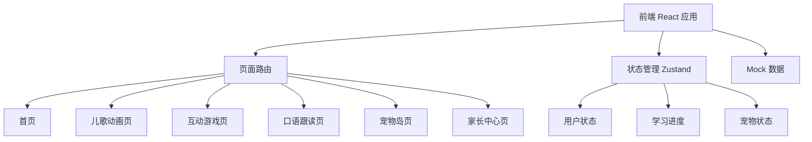
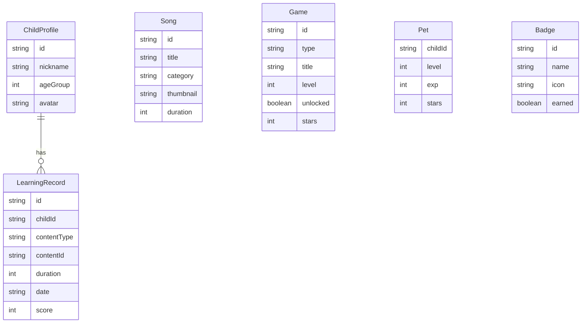

# 兔兔英语 - 技术架构文档

## 1. 架构设计

本项目为UI原型阶段，采用纯前端方案模拟微信小程序交互体验。



## 2. 技术说明

- **前端框架**：React@18 + TypeScript
- **样式方案**：Tailwind CSS@3
- **构建工具**：Vite
- **状态管理**：Zustand
- **路由**：react-router-dom@6
- **图标**：lucide-react
- **动画**：CSS Animations + Framer Motion（如需复杂动画）
- **后端**：无（UI原型阶段，使用Mock数据）
- **数据库**：无（使用内存状态 + Mock数据模拟）

## 3. 路由定义

| 路由 | 用途 |
|------|------|
| `/` | 首页 - 问候区、今日推荐、快速入口、学习进度 |
| `/songs` | 儿歌动画页 - 分类、列表、播放器 |
| `/songs/:id` | 儿歌播放详情页 |
| `/games` | 互动游戏页 - 游戏类型选择 |
| `/games/pick` | 点选类游戏关卡列表 |
| `/games/puzzle` | 拼图类游戏关卡列表 |
| `/games/color` | 涂色类游戏关卡列表 |
| `/games/pick/:levelId` | 点选游戏具体关卡 |
| `/games/puzzle/:levelId` | 拼图游戏具体关卡 |
| `/games/color/:levelId` | 涂色游戏具体关卡 |
| `/speaking` | 口语跟读页 - 发音示范、跟读录制、AI评分 |
| `/pet` | 宠物岛页 - 宠物养成、徽章、积分 |
| `/parent` | 家长中心页 - 学习报告、时长管控、护眼设置、孩子档案 |

## 4. 数据模型

### 4.1 数据模型定义



## 5. 项目目录结构

```
src/
├── components/          # 通用组件
│   ├── Layout/          # 布局组件（底部Tab栏、顶部导航）
│   ├── Bunny/           # 小兔子IP组件（不同表情/动作）
│   ├── ProgressBar/     # 进度条组件
│   ├── StarRating/      # 星级评分组件
│   └── GameCard/        # 游戏卡片组件
├── pages/
│   ├── Home/            # 首页
│   ├── Songs/           # 儿歌动画页
│   ├── Games/           # 互动游戏页
│   ├── Speaking/        # 口语跟读页
│   ├── Pet/             # 宠物岛页
│   └── Parent/          # 家长中心页
├── stores/              # Zustand状态管理
│   ├── useChildStore.ts
│   ├── useLearningStore.ts
│   └── usePetStore.ts
├── data/                # Mock数据
│   ├── songs.ts
│   ├── games.ts
│   └── badges.ts
├── hooks/               # 自定义Hooks
├── utils/               # 工具函数
├── App.tsx
└── main.tsx
```

## 6. 设计Token规范

```css
/* 主色 */
--color-primary: #FF8C42;       /* 暖橙色 */
--color-primary-light: #FFB07A;
--color-primary-dark: #E67A30;

/* 辅助色 */
--color-success: #7ED957;       /* 薄荷绿 - 正确反馈 */
--color-info: #64B5F6;          /* 天空蓝 - 信息提示 */
--color-pink: #FFB5C2;          /* 柔和粉 - 装饰 */

/* 背景色 */
--color-bg: #FFF8F0;            /* 奶白色主背景 */
--color-bg-card: #FFF3D6;       /* 浅黄卡片背景 */
--color-bg-game: #E8F5E9;       /* 浅绿游戏背景 */

/* 文字色 */
--color-text-primary: #3D2C2C;  /* 深棕色主文字 */
--color-text-secondary: #8B7E7E; /* 灰棕次要文字 */
--color-text-light: #FFFFFF;    /* 白色文字（深色背景上） */

/* 圆角 */
--radius-sm: 8px;
--radius-md: 12px;
--radius-lg: 16px;
--radius-xl: 24px;
--radius-full: 9999px;

/* 阴影 */
--shadow-card: 0 4px 12px rgba(0,0,0,0.08);
--shadow-button: 0 4px 0 rgba(0,0,0,0.15);
```
